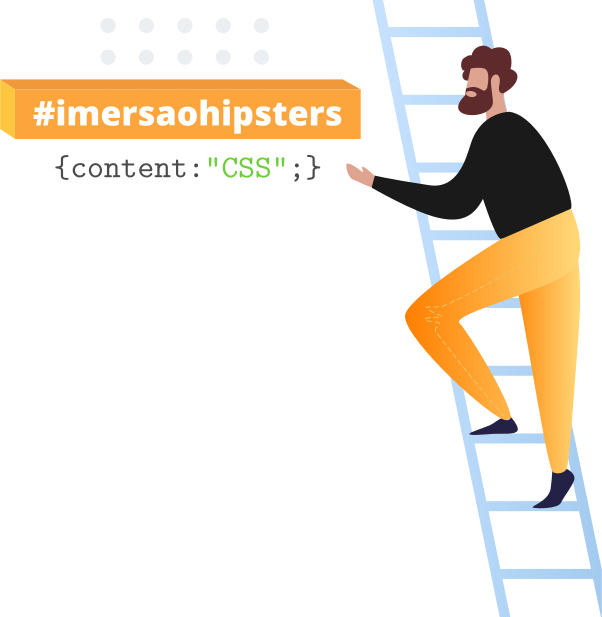

# Imersão Hipsters CSS

:warning: Desenvolvido durante a #ImersãoHipstersCSS

## :bookmark_tabs: Aulas

1. [:bookmark: 1-css-pagina-pessoal](./imersaoCSS/aula1/css-pagina-pessoal.md "Texto da aula 1")

## :pencil: Versionamento

Eu uso [Git ](https://git-scm.com/ "Site oficial do Git") para versionamento.

## :octocat: Autor

|                                   [@newtmagalhaes][autor]                                    |
| :------------------------------------------------------------------------------------------: |
| [][autor] |

## :scroll: Licença

Este projeto está licenciado sob _MIT License_ - veja o arquivo [LICENSE](./LICENSE "Licença do repositório") para detalhes.

[autor]: https://github.com/newtmagalhaes "Perfil do autor"
