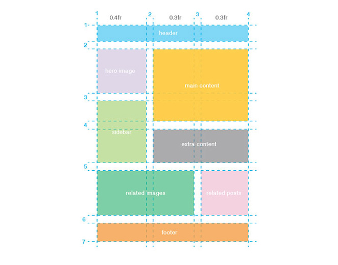

# Aula 3: CSS para Página Pessoal

> [:link: Site](https://www.alura.com.br/imersao-css/aula03-grid "Site da aula 3")

Chegamos na metade da nossa **#ImersaoCSS** e ainda tem muito conteúdo pra ver!

Para essa aula continuamos com o **HTML** de onde paramos!
Um exemplo do resultado está publicado [nessa página](http://www.vanessametonini.com.br/imersaocss/a3/).

Se quiser baixar os arquivos com o código que desenvolvemos na aula, pode baixar [aqui](https://github.com/caelum/imersaocss/archive/aula3.zip) (em zip).

## Aula

> [:link: Videoaula](https://www.youtube.com/watch?v=mHC1k-18lQI "Vídeo não listado no youtube")

## Desafios aula 3

Vocês estão arrasando nos desafios, topam mais alguns?

### Desafio do Paulo

A gente já viu que tem bastante gente fazendo dessa forma, mas quem ainda não fez agora é a hora de colocar a sua cara no seu site: seus projetos, suas seções, suas imagens!

### Desafios da Juliana

- Durante essa aula vimos uma outra ferramenta do **CSS** para posicionar elementos, o _Grid_.
  Temos mais um [joguinho](https://cssgridgarden.com/) (infelizmente é o último) para praticar o **CSS** _Grid_ enquanto cuida de uma hortinha e rega as plantas, bem relaxante!

- Você pode usar as ferramentas do _Grid_ para montar um leiaute de página web como este.
  Não esqueça de compartilhar com a gente!

  

## Pronto para ir além da aula

- O **CSS** _Grid_ tem várias propriedades e o [CSS Tricks](https://css-tricks.com) tem um [guia](https://css-tricks.com/snippets/css/complete-guide-grid/) com exemplos de como usar (em inglês).

Bons estudos e até a próxima aula!

## Participantes

- [Vanessa Tonini](https://twitter.com/vanessametonini)

- [Juliana Amoasei](https://twitter.com/aquijuz)

- [Paulo Silveira](https://twitter.com/paulo_caelum)
